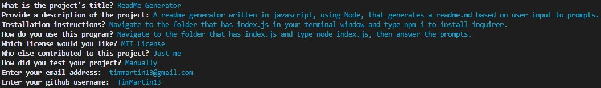

# ReadMe Generator
  
  [](https://opensource.org/licenses/MIT)

  ## Description

  A readme generator written in javascript, using Node.js, that generates a readme.md based on user input to various prompts.  The prompts are written using the npm inquirer package.

  
  ## Table of Contents
  
  * [Installation](#installation)
  * [Usage](#usage)
  * [Contributions](#contributions)
  * [Tests](#tests)
  * [License](#license)
  * [Questions](#questions)
  
  
  
  ## Installation

  Navigate to the folder that has index.js in your terminal window and type npm i to install the inquirer package.

  ```
  $ npm i
  ```
  This will install the version of the inquirer package that is needed for this program.


  
  ## Usage

  Navigate to the folder that has index.js in your terminal window and type node index.js, then answer the prompts.

  ```
  $ node index.js
  ```  
  This will run the program. Answer the following prompts about your project and when you are finished, the generator will generate a readme.md automatically.

  ### Prompt example:
  

  
  
  ## Tests

  ### Example .gif
  [](https://drive.google.com/file/d/1jXiEXiVs3TptqMwrtpNIDQXYKlipxSia/view "Readme Generator")
  
  ### Video Link

  https://drive.google.com/file/d/1jXiEXiVs3TptqMwrtpNIDQXYKlipxSia/view


  ## License

Licensed under the [MIT](https://choosealicense.com/licenses/mit/) license 

  
  
  ## Questions

  Email: timmartin13@gmail.com

  Github: github.com/TimMartin13

